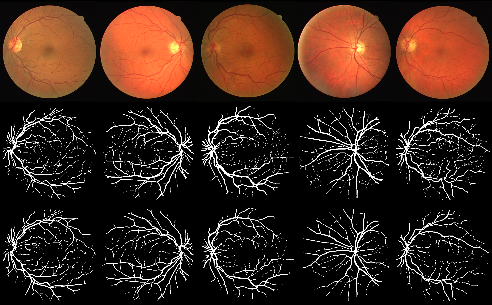

# UNet for Retina Vessel Segmentation

UNet for retina vessel segmentation.



## Usage
We run the code on Ubuntu 18.04 LTS with a GTX 1080ti GPU.

### Requirement
[Python](<https://www.python.org>) (3.7.3) |
[Tensorflow](<https://tensorflow.google.cn/install>) (2.0.0) |
[CUDA](<https://developer.nvidia.com/cuda-toolkit-archive>) (10.0) |
[cuDNN](<https://developer.nvidia.com/cudnn>) (7.6.0)

### Data
You can download the datasets from
[here](<https://drive.grand-challenge.org/Download/>). And then move the files into the ***./data/*** folder.


### Preprocess
Because of my RAM limited, I firstly transform the train.mat file to .tfrecord files.
```
python preprocess.py
```

### Train
Then you can train the model initially.
```
CUDA_VISIBLE_DEVICES=0 python main.py -e train -c ./config/config_0.ini
```

### Test
When you have trained successfully, you can evaluate the model.
```
CUDA_VISIBLE_DEVICES=0 python main.py -e test -c ./config/config_0.ini
```


## Result
| Metric | Value |
| :----: | :----: |
| *Area under ROC curve* | 0.9791076715589634 |
| *Area under PR curve* | 0.9096035722442897 |

For threshold: 0.5

| Metric | Value |
| :----: | :----: |
| *Jaccard similarity score* | 0.6899763444446503
| *F1 score (F-measure)* | 0.8165514821704634
| *Accuracy* | 0.9557572337407614
| *Precision* | 0.8645987922457612
| *Recall* | 0.7735631845636364


## REFERENCE
> [https://github.com/orobix/retina-unet](<https://github.com/orobix/retina-unet>)